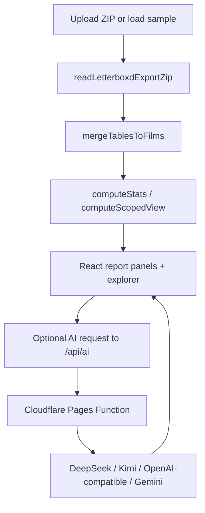
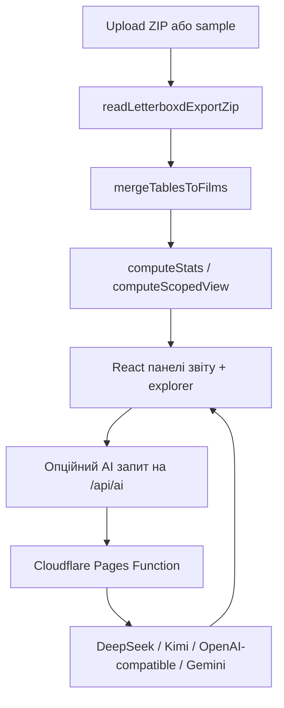

<div align="center">
	
</div>

<p align="center">
	
	
	
	
	
</p>

<p align="center">
	
</p>

# Letterboxd AI Review

A production-minded, no-login web app that parses your Letterboxd export ZIP locally, merges the CSV layers into one film model, computes deep analytics, and generates AI taste notes in roast or praise mode.

Live: https://erikdev.cc

## Contents

- [English](#english)
- [Українська](#українська)

---

## English

### Why this exists

Letterboxd exports are split across multiple CSV files with different semantics. This project unifies those files into one reliable film-level dataset, then turns it into useful analysis and shareable outputs.

You get:

- Local parsing and analytics in the browser
- Strong merge diagnostics and data quality reporting
- Rich report sections and drilldowns
- AI-generated commentary based on a compact profile payload
- Export options for text, card image, and CSV slices

### Core feature set

#### 1. Import and parsing pipeline

- Upload any Letterboxd export ZIP
- Or load bundled sample data from public/sample_data.zip
- ZIP parsing via JSZip, CSV parsing via PapaParse
- Recognizes active tables: watched.csv, ratings.csv, reviews.csv, diary.csv, watchlist.csv, profile.csv, comments.csv
- Also recognizes archived and auxiliary files under deleted/, orphaned/, likes/, and lists/

#### 2. Merge model and truth rules

- watched.csv creates the watched baseline
- ratings.csv writes current rating layer
- diary.csv and reviews.csv contribute logged rating, exact watched dates, tags, rewatch flags, and row-level events
- reviews.csv contributes review text
- comments.csv is parsed but not treated as review text
- Films present only in ratings/reviews/diary are still materialized in the film table
- URI layers are preserved separately for film pages vs diary/review entries

#### 3. Analytics and reporting

- Overview metrics: watched/rated totals, date coverage, streaks
- Watch activity: exact-date heatmap, busiest periods, gaps, streak quality
- Ratings: current/logged distributions and rating-drift analysis
- Release analytics: decade and year breakdowns
- Backlog analytics: watchlist growth and watched-vs-watchlist comparison
- Review stats: coverage, length distributions, top words, longest entries
- Archive/list diagnostics: deleted, orphaned, likes, and list metadata
- Data quality panel: module-level coverage signals

#### 4. AI generation

- Modes: roast or praise
- Roast intensity: 1 to 3
- Providers supported by API layer:
	- default: built-in DeepSeek key from environment
	- default_kimi: built-in Kimi key/model from environment with fallback profile shrinking and retry behavior
	- openai_compat: user-provided key/base URL/model for OpenAI-compatible endpoints
	- gemini: user-provided Gemini API key and optional model
- Output contract is plain text (no markdown formatting)

#### 5. Explorer, saved views, and exports

- Film/review/watch-event explorer modes
- Scope filters for basis, decade/year, rating ranges, and review presence
- Saved view snapshots persisted in localStorage
- Exports:
	- Copyable summary text
	- Share card image (html2canvas)
	- CSV exports for explorer datasets

### Architecture at a glance



### API surface

#### POST /api/ai

- Request body fields include provider, language, mode, roastLevel, profile, and provider-specific credentials
- Returns text, provider, model, and remaining quota
- Applies IP-based daily rate limiting (KV-backed when RLKV is bound)

#### GET /api/health

- Returns plain ok response for health checks

### Tech stack

- Frontend: React 18 + TypeScript + Vite
- Parsing: JSZip + PapaParse
- Image export: html2canvas
- Runtime API: Cloudflare Pages Functions

### Project structure

- src/components: report UI modules and explorer surfaces
- src/lib: parsing, merge logic, statistics, scopes, exports, saved views, data quality
- functions/api: serverless AI and health endpoints
- scripts: verification and data-layer test scripts
- public/sample_data.zip: deterministic sample fixture

### Local development

```bash
npm install
npm run dev
```

Notes:

- Dev server runs on port 5173
- Vite dev middleware bridges /api/ai and /api/health to the same handler code used in Pages Functions

### Build, verify, and preview

```bash
npm run build:testlib
npm run test:data
npm run verify:sample
npm run build
npm run preview
```

What these do:

- build:testlib: compiles library modules into .verify for node-side checks
- test:data: runs synthetic data-layer regression assertions
- verify:sample: validates behavior against public/sample_data.zip and cross-module invariants
- build: TypeScript check + Vite production bundle
- preview: serves the production build locally

### Deployment (Cloudflare Pages)

- Build command: npm run build
- Output directory: dist
- Functions directory: functions

Environment variables supported by the AI endpoint:

- OPENAI_API_KEY
- OPENAI_BASE_URL
- OPENAI_MODEL
- OPENAI_API_KEY2
- OPENAI_BASE_URL2
- OPENAI_MODEL2
- GEMINI_API_KEY
- GEMINI_MODEL
- AI_DAILY_LIMIT
- AI_BYPASS_IPS
- RLKV binding (KV namespace)

### Privacy model

- No account system, no mandatory backend profile storage
- Parsing and analytics happen in-browser
- Only AI requests send a compact profile payload to /api/ai

### Current caveats

- This repository currently does not include a dedicated OSS license file
- AI quality depends on provider model behavior and quota settings

---

## Українська

### Навіщо цей проєкт

Експорт Letterboxd складається з кількох CSV файлів із різною семантикою. Цей застосунок об’єднує їх у єдину надійну модель фільму, а потім будує аналітику та зручні формати для поширення.

Ви отримуєте:

- Локальний розбір і обчислення в браузері
- Якісну діагностику злиття та перевірку якості даних
- Багаті звіти та drilldown-перегляди
- AI-коментар на основі компактного профілю
- Експорт у текст, картку-зображення та CSV

### Основні можливості

#### 1. Імпорт і пайплайн розбору

- Завантаження будь-якого ZIP-експорту Letterboxd
- Або запуск вбудованого прикладу з public/sample_data.zip
- Розбір ZIP через JSZip, CSV через PapaParse
- Розпізнає активні таблиці: watched.csv, ratings.csv, reviews.csv, diary.csv, watchlist.csv, profile.csv, comments.csv
- Також читає архівні й допоміжні файли в deleted/, orphaned/, likes/, lists/

#### 2. Модель злиття і правила істини

- watched.csv формує базу переглянутих фільмів
- ratings.csv формує шар поточних оцінок
- diary.csv і reviews.csv додають logged-оцінки, точні дати перегляду, теги, rewatch та події на рівні рядків
- reviews.csv додає текст рецензій
- comments.csv парситься, але не вважається рецензіями
- Фільми, які є лише в ratings/reviews/diary, все одно додаються в єдину таблицю
- URI для сторінки фільму та URI для diary/review записів зберігаються окремо

#### 3. Аналітика і звіти

- Overview-метрики: обсяг переглядів/оцінок, покриття дат, streak
- Активність переглядів: exact-date heatmap, пікові періоди, паузи, якість streak
- Оцінки: розподіли current/logged і аналіз rating drift
- Аналітика релізів: розбивка за роками та десятиліттями
- Аналітика backlog: динаміка watchlist та порівняння watched-vs-watchlist
- Статистика рецензій: покриття, довжини, top words, найдовші тексти
- Архіви та списки: deleted, orphaned, likes та метадані списків
- Data quality панель: сигнали покриття модулів

#### 4. Генерація AI

- Режими: roast або praise
- Інтенсивність roast: від 1 до 3
- Провайдери в API:
	- default: вбудований DeepSeek ключ із середовища
	- default_kimi: вбудований Kimi ключ/модель із середовища + fallback зі зменшенням профілю та retry
	- openai_compat: користувацькі key/base URL/model для OpenAI-сумісних endpoint
	- gemini: користувацький Gemini API key та опційна модель
- Контракт відповіді: plain text без markdown

#### 5. Explorer, збережені перегляди та експорт

- Режими explorer: фільми, рецензії, події переглядів
- Scope-фільтри: basis, decade/year, діапазони рейтингів, наявність рецензії
- Saved views зберігаються в localStorage
- Експорт:
	- Копійований текстовий summary
	- Share card як зображення (html2canvas)
	- CSV-експорт для explorer-даних

### Архітектура



### API поверхня

#### POST /api/ai

- Тіло запиту включає provider, language, mode, roastLevel, profile та credential-поля залежно від провайдера
- У відповіді: text, provider, model, remaining quota
- Добовий IP-rate limit (через KV, якщо підключено RLKV)

#### GET /api/health

- Повертає простий ok для health-check

### Техстек

- Frontend: React 18 + TypeScript + Vite
- Parsing: JSZip + PapaParse
- Експорт зображення: html2canvas
- Runtime API: Cloudflare Pages Functions

### Структура проєкту

- src/components: UI-модулі звітів і explorer
- src/lib: парсинг, merge-логіка, статистика, scopes, експорт, saved views, data quality
- functions/api: serverless endpoint для AI та health
- scripts: скрипти верифікації і тестів data layer
- public/sample_data.zip: стабільний sample-фікстур

### Локальна розробка

```bash
npm install
npm run dev
```

Нотатки:

- Dev server працює на порту 5173
- Vite middleware прокидує /api/ai і /api/health на ті самі handlers, що і в Pages Functions

### Збірка, перевірка, preview

```bash
npm run build:testlib
npm run test:data
npm run verify:sample
npm run build
npm run preview
```

Що роблять команди:

- build:testlib: компілює бібліотечні модулі у .verify для node-перевірок
- test:data: запускає синтетичні regression-перевірки data layer
- verify:sample: перевіряє поведінку на public/sample_data.zip і міжмодульні інваріанти
- build: TypeScript перевірка + production bundle Vite
- preview: локальна перевірка production-збірки

### Деплой (Cloudflare Pages)

- Build command: npm run build
- Output directory: dist
- Functions directory: functions

Підтримувані environment variables для AI endpoint:

- OPENAI_API_KEY
- OPENAI_BASE_URL
- OPENAI_MODEL
- OPENAI_API_KEY2
- OPENAI_BASE_URL2
- OPENAI_MODEL2
- GEMINI_API_KEY
- GEMINI_MODEL
- AI_DAILY_LIMIT
- AI_BYPASS_IPS
- RLKV binding (KV namespace)

### Приватність

- Немає системи акаунтів і обов’язкового бекенд-зберігання профілю
- Розбір і аналітика виконуються у браузері
- Лише AI-запит відправляє компактний payload профілю на /api/ai

### Поточні зауваження

- У репозиторії зараз немає окремого файлу ліцензії OSS
- Якість AI-результату залежить від моделі провайдера та квот
